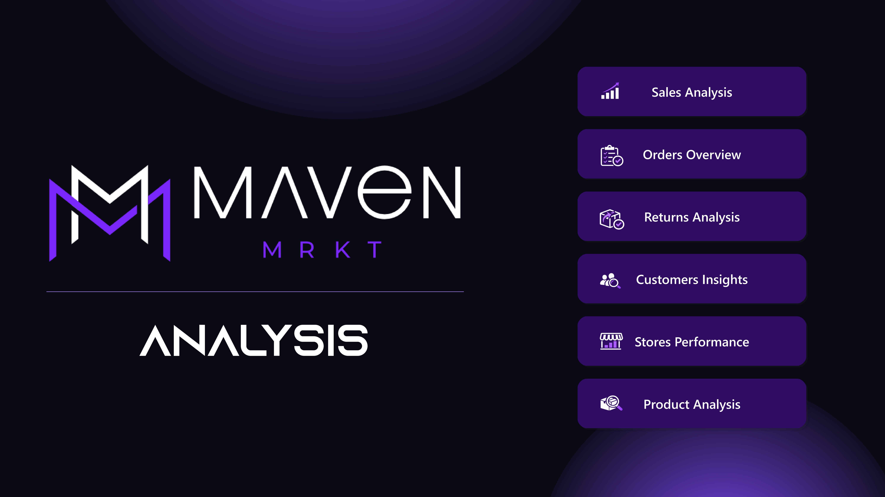
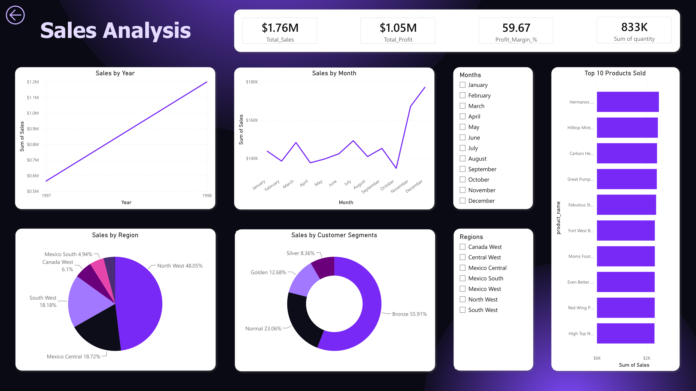
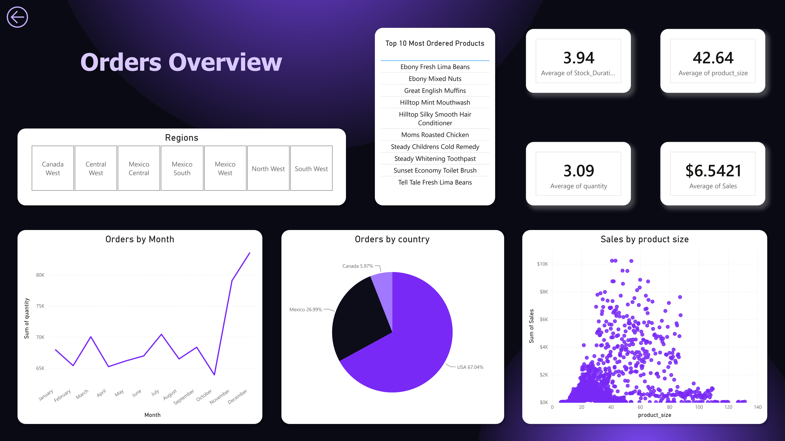
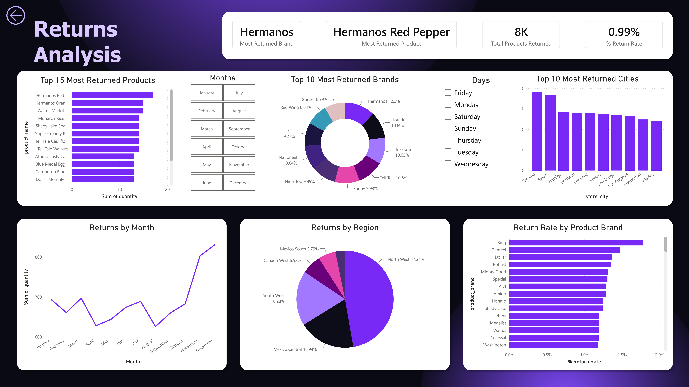
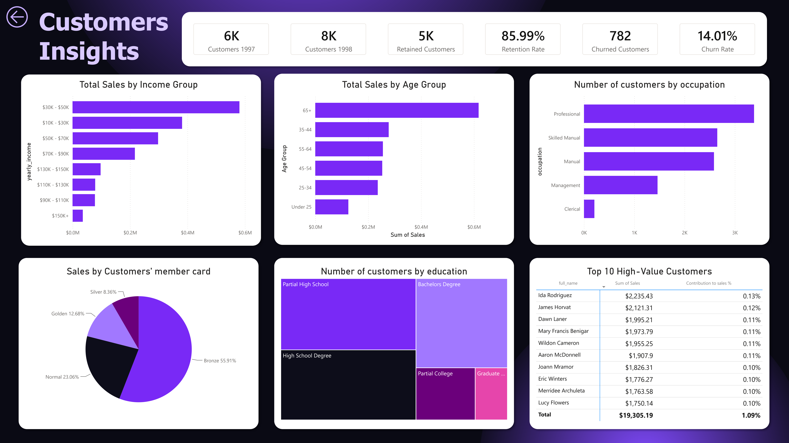
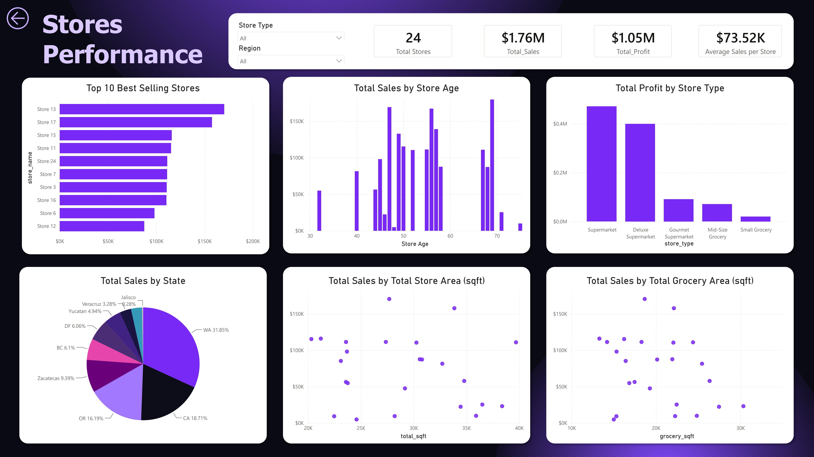

# Maven Market Analysis | End-to-End Business Intelligence Dashboard using Power BI

> An end-to-end Business Intelligence project built with Power BI that transforms raw retail data into actionable business insights through interactive dashboards covering Sales, Orders, Returns, Customers, Stores, and Products.

---

The dashboard consists of seven interactive pages:

- Home
- Sales Analysis
- Orders Overview
- Returns Analysis
- Customers Insights
- Stores Performance
- Product Analysis

---

# Executive Summary

Maven Market is a multinational grocery retail chain operating across the United States, Canada, and Mexico. The organization collects large volumes of transactional, customer, product, and store-level data, making it difficult to monitor business performance using raw spreadsheets alone.

The objective of this project was to transform this raw retail data into an interactive Business Intelligence solution capable of answering key business questions related to sales performance, customer behavior, product profitability, store efficiency, and product returns.

Using **Power BI Desktop**, the complete analytics workflow was developed, including data cleaning, transformation, modeling, DAX calculations, and dashboard design. Data from multiple sources was consolidated into a star schema model, enabling efficient analysis across multiple business dimensions.

The final dashboard consists of **seven interactive pages**, allowing business users to monitor KPIs, identify trends, evaluate performance, and make data-driven decisions through dynamic filtering and drill-down capabilities.

### Overall Dashboard Highlights

| KPI | Value |
|------|-------|
| Total Sales | **$1.76M** |
| Total Profit | **$1.05M** |
| Profit Margin | **59.67%** |
| Products Sold | **833K Units** |
| Products Returned | **8K Units** |
| Return Rate | **0.99%** |
| Customer Retention Rate | **85.99%** |
| Total Stores | **24** |

The dashboard enables stakeholders to:

- Monitor business performance in real time
- Identify top-performing products and regions
- Evaluate customer purchasing behavior
- Analyze product return patterns
- Compare store performance
- Optimize inventory decisions
- Support strategic business planning using data

---

# Business Problem

Retail organizations generate millions of transaction records across different locations, customers, and products. While this data contains valuable insights, it becomes increasingly difficult for decision-makers to extract meaningful information without an effective reporting system.

The Maven Market dataset contains information related to:

- Customer purchases
- Product catalog
- Sales transactions
- Product returns
- Store information
- Regional hierarchy

Without an integrated analytics platform, answering important business questions becomes time-consuming and inefficient.

Examples include:

- Which products generate the highest revenue?
- Which regions contribute most to profit?
- Which products experience the highest return rates?
- Which customer segments drive the majority of sales?
- Which stores require operational improvements?
- How has business performance changed over time?

This project addresses these challenges by providing an interactive Power BI dashboard that transforms raw operational data into meaningful business insights.

---

# Project Objectives

The primary objective of this project is to design an end-to-end Business Intelligence solution that enables stakeholders to monitor and analyze Maven Market's overall business performance.

The dashboard focuses on the following objectives:

### Sales Analysis

- Analyze sales trends across months and years
- Compare regional sales performance
- Identify top-selling products
- Evaluate customer segment contribution
- Measure profitability using key KPIs

### Orders Overview

- Analyze order volume trends
- Understand purchasing patterns
- Compare order size across products
- Evaluate order distribution by country

### Returns Analysis

- Measure return rate
- Identify frequently returned products
- Analyze return trends across regions and months
- Evaluate return performance by product brand

### Customer Insights

- Analyze customer demographics
- Measure customer retention and churn
- Identify high-value customers
- Compare purchasing behavior across member card types

### Stores Performance

- Compare store performance
- Evaluate profitability by store type
- Analyze sales across states and regions
- Study the relationship between store size and revenue

### Product Analysis

- Identify best-selling products
- Discover high-margin products
- Detect slow-moving inventory
- Compare product performance across regions

---

# Dataset Overview

The project uses the **Maven Market** retail dataset, which simulates the operations of a multinational grocery chain.

The dataset contains transactional and dimensional data covering customers, products, stores, returns, and regional information across multiple countries.

### Dataset Tables

| Table | Description |
|--------|-------------|
| Transactions 1997 | Sales transactions for 1997 |
| Transactions 1998 | Sales transactions for 1998 |
| Customers | Customer demographic information |
| Products | Product catalog and pricing |
| Stores | Store information and attributes |
| Regions | Geographic hierarchy |
| Returns | Returned products |
| Calendar | Date dimension created for time intelligence |

The project integrates these datasets into a unified data model to support interactive reporting and advanced business analysis.

---

# Tech Stack

The project was developed using the following technologies:

| Tool | Purpose |
|------|---------|
| **Power BI Desktop** | Dashboard development and visualization |
| **Power Query Editor** | Data cleaning, transformation, and ETL |
| **DAX (Data Analysis Expressions)** | Calculated columns, measures, and KPIs |
| **Microsoft Excel** | Source dataset management |

---

# Data Preparation

Data preparation was performed using **Power Query Editor** before loading the data into the Power BI model.

The following preprocessing steps were carried out to ensure data quality and consistency:

- Appended transaction datasets from 1997 and 1998 into a unified transaction table.
- Merged queries to enrich transactional data with additional business information.
- Corrected and standardized data types across all tables.
- Handled blank and missing values where necessary.
- Created custom columns to support business analysis.
- Removed unnecessary fields to optimize the data model.
- Standardized date formats for consistent reporting.
- Built a dedicated Calendar table to enable time intelligence analysis.
- Verified data integrity after transformation.
- Prepared clean datasets for efficient modeling and reporting.

These preprocessing steps ensured that the dashboard was built on reliable, analysis-ready data.

---

# Data Modeling

  

A **Star Schema** data model was designed to improve report performance, simplify filtering, and support scalable analytics.

### Fact Tables

- Transactions
- Returns

### Dimension Tables

- Customers
- Products
- Stores
- Regions
- Calendar

The model uses one-to-many relationships between dimension tables and fact tables, enabling efficient cross-filtering throughout the dashboard.

The Calendar table was created specifically to support time intelligence calculations such as monthly and yearly sales trends.

This modeling approach improves query performance while keeping the dashboard organized, maintainable, and scalable.

---

# DAX Measures

Several custom DAX measures were created to calculate business KPIs and enhance analytical capabilities.

## Sales Metrics

- Total Sales
- Total Profit
- Profit Margin %

## Customer Metrics

- Customers (1997)
- Customers (1998)
- Retention Rate
- Churn Rate

## Returns Metrics

- Return Rate
- Total Products Returned
- Most Returned Product
- Most Returned Brand

## Store Metrics

- Total Stores
- Average Sales per Store
- Store Age

## Product Metrics

- Average Selling Price

These measures provide dynamic calculations that automatically respond to report filters and slicers, enabling flexible and interactive analysis across the dashboard.

---

# Dashboard Walkthrough

The Maven Market dashboard consists of seven interactive pages, each designed to analyze a specific aspect of the business. Together, these reports provide a comprehensive view of organizational performance, enabling stakeholders to monitor KPIs, identify trends, and make informed business decisions.

---

# Home Page

  

## Purpose

The Home Page serves as the central navigation hub of the dashboard, providing users with a clean and intuitive interface to access every analytical report. Instead of relying on Power BI's default page tabs, custom navigation buttons create an application-like experience, making the dashboard easier to explore.

## Features

- Interactive navigation buttons
- Consistent dashboard theme
- User-friendly layout
- Quick access to all report pages
- Professional landing page design

## Business Value

A well-designed landing page significantly improves the user experience by reducing navigation effort and making the dashboard accessible to both technical and non-technical stakeholders.

---

# Sales Analysis

  

## Objective

The Sales Analysis page provides a comprehensive overview of Maven Market's sales performance across different time periods, regions, customer segments, and products. The objective is to identify revenue trends, understand profitability, and uncover the primary drivers of business growth.

---

## Key Performance Indicators (KPIs)

- Total Sales
- Total Profit
- Profit Margin %
- Total Quantity Sold

---

## Visualizations Included

- Sales by Year
- Sales by Month
- Sales by Region
- Sales by Customer Membership
- Top 10 Best Selling Products
- Interactive Region Filter
- Month Slicer
- KPI Cards

---

## Business Questions Answered

- How has sales performance changed over time?
- Which year generated the highest revenue?
- Which months recorded peak sales?
- Which regions contribute the highest sales?
- Which customer membership tier generates the most revenue?
- Which products are the top revenue generators?
- How profitable is the business overall?

---

## Key Insights

### Overall Business Performance

The business generated approximately **$1.76 million** in total sales while achieving **$1.05 million** in total profit, resulting in an impressive **59.67% profit margin**. This indicates that Maven Market maintains strong profitability across its retail operations.

### Sales Trend

Sales increased from 1997 to 1998, indicating positive business growth and improving customer demand over time.

### Regional Performance

The **North West** region contributed nearly half of the company's total sales, making it the strongest performing market. Mexico Central and South West also generated significant revenue, while Canada West contributed a comparatively smaller share.

### Customer Segments

Customers holding **Bronze membership cards** generated the largest portion of total sales, followed by Normal, Golden, and Silver members. This suggests that although premium memberships exist, the majority of revenue comes from regular retail customers.

### Product Performance

A relatively small number of products contribute a significant portion of total revenue. Products such as **Hermanos**, **Hilltop**, and **Carlson** consistently appear among the highest-selling products, highlighting their importance within the product portfolio.

---

## Business Value

This page enables management to:

- Monitor overall business performance.
- Track sales growth over time.
- Identify high-performing regions.
- Evaluate customer purchasing behavior.
- Optimize inventory planning.
- Prioritize profitable product categories.

---

# Orders Overview

  

## Objective

The Orders Overview page focuses on purchasing behavior by analyzing order volumes, product demand, geographical distribution, and ordering patterns. The report helps stakeholders understand customer purchasing trends and supports inventory planning.

---

## Key Metrics

- Average Order Size
- Average Product Size
- Average Sales per Order
- Average Stock Duration

---

## Visualizations Included

- Monthly Order Volume
- Orders by Country
- Product Size Distribution
- Top 10 Most Ordered Products
- Regional Slicer
- KPI Cards

---

## Business Questions Answered

- How many products are ordered throughout the year?
- Which months experience the highest order volumes?
- Which countries generate the highest number of orders?
- Which products are ordered most frequently?
- What is the average order size?
- How does product size relate to purchasing behavior?

---

## Key Insights

### Monthly Order Trends

Monthly order volumes remain relatively stable throughout the year, indicating consistent customer demand with only moderate seasonal fluctuations.

### Geographic Distribution

The **United States** accounts for approximately **67%** of all orders, making it Maven Market's largest operating market. Mexico contributes nearly **27%**, while Canada accounts for approximately **6%** of total orders.

### Product Demand

Products such as **Ebony Fresh Lima Beans**, **Hilltop Mint Mouthwash**, and **Great English Muffins** rank among the most frequently ordered products, indicating consistently strong customer demand.

### Product Size Analysis

The average product size purchased is approximately **42.64**, providing insights into customer purchasing preferences and helping optimize inventory management.

### Order Characteristics

Average order quantities remain relatively consistent, suggesting stable purchasing behavior across customers rather than extreme variations in order size.

---

## Business Value

This page assists business users in:

- Forecasting inventory demand.
- Understanding customer purchasing behavior.
- Identifying high-demand products.
- Optimizing warehouse operations.
- Improving supply chain planning.
- Supporting inventory replenishment strategies.

---

## Interactive Features

All report pages support interactive filtering, allowing users to explore business performance dynamically.

Available interactions include:

- Cross-filtering between visuals
- Month slicers
- Regional filtering
- Drill-down capabilities
- Interactive KPI updates
- Dynamic charts responding to user selections

These interactive features enable users to perform self-service analytics without requiring additional reports or manual calculations.

# Returns Analysis

  

## Objective

The Returns Analysis page evaluates product return behavior across different regions, brands, products, cities, and time periods. Understanding return patterns helps the business identify quality issues, improve customer satisfaction, minimize revenue loss, and optimize inventory management.

---

## Key Performance Indicators (KPIs)

- Total Products Returned
- Return Rate
- Most Returned Product
- Most Returned Brand

---

## Visualizations Included

- Returns by Month
- Returns by Region
- Return Rate by Product Brand
- Top 15 Most Returned Products
- Top 10 Most Returned Brands
- Top 10 Cities with Highest Returns
- Month and Day Slicers

---

## Business Questions Answered

- What is the company's overall return rate?
- Which products are returned most frequently?
- Which brands experience the highest number of returns?
- Which regions generate the highest return volume?
- Which cities contribute the most product returns?
- How do returns vary throughout the year?
- Which brands have the highest percentage return rate?

---

## Key Insights

### Overall Return Performance

The overall product return rate is approximately **0.99%**, indicating that fewer than one product out of every hundred sold is returned. This suggests strong product quality and effective order fulfillment across the business.

### Product Returns

**Hermanos Red Pepper** emerged as the most returned product, indicating that this item may require further investigation into product quality, packaging, customer expectations, or supplier performance.

### Brand Performance

The **Hermanos** brand records the highest number of product returns among all brands. While this may partially reflect its strong sales volume, monitoring return frequency is important to determine whether quality improvements are required.

### Regional Analysis

The **North West** region accounts for nearly half of all returned products, making it the primary contributor to overall returns. Since this region also generates the highest sales, return performance should be evaluated relative to sales volume for more meaningful insights.

### Geographic Distribution

Cities such as **Tacoma**, **Salem**, and **Hidalgo** record the highest return volumes, helping management identify locations where operational improvements or customer education may reduce return rates.

### Brand Return Rate

Although several brands generate high return volumes, the return rate analysis highlights brands whose returns are disproportionately high relative to sales. These brands should be prioritized for detailed investigation.

---

## Business Value

This page helps management to:

- Monitor product quality.
- Identify problematic products.
- Reduce operational losses caused by returns.
- Improve supplier evaluation.
- Enhance customer satisfaction.
- Optimize inventory planning.

---

# Customers Insights

  

## Objective

The Customers Insights page explores customer demographics, purchasing behavior, membership programs, income groups, and retention metrics. The goal is to better understand customer characteristics, improve retention strategies, and identify high-value customer segments.

---

## Key Performance Indicators (KPIs)

- Customer Retention Rate
- Customer Churn Rate
- Customers (1997)
- Customers (1998)
- Retained Customers
- Churned Customers

---

## Visualizations Included

- Sales by Membership Card
- Customers by Occupation
- Customers by Education
- Sales by Income Group
- Sales by Age Group
- Top 10 High-Value Customers
- KPI Cards

---

## Business Questions Answered

- What percentage of customers are retained?
- How many customers were gained between 1997 and 1998?
- Which membership tier contributes the highest revenue?
- Which occupations generate the largest customer base?
- Which education levels dominate the customer population?
- Which income groups spend the most?
- Who are the company's highest-value customers?

---

## Key Insights

### Customer Growth

The customer base increased from approximately **6,000 customers in 1997** to nearly **8,000 customers in 1998**, indicating successful business growth and customer acquisition.

### Customer Retention

The business achieved an impressive **85.99% customer retention rate**, while maintaining a relatively low churn rate of **14.01%**. This indicates strong customer loyalty and effective customer relationship management.

### Membership Analysis

Customers with **Bronze membership cards** contribute the highest share of sales. Although premium membership tiers exist, the largest revenue continues to come from regular customers.

### Customer Demographics

Professionals represent the largest occupational customer group, while customers with High School and Partial College education form a significant portion of the customer base.

### Income Analysis

Customers earning between **$30K–$50K annually** contribute the highest sales, suggesting that middle-income households represent Maven Market's primary target market.

### Customer Value

The top ten customers contribute approximately **1.09%** of total sales. Revenue is therefore well distributed across the customer base rather than relying heavily on a small group of buyers.

---

## Business Value

The customer dashboard enables management to:

- Improve customer retention strategies.
- Develop targeted marketing campaigns.
- Understand purchasing behavior.
- Identify valuable customer segments.
- Optimize loyalty programs.
- Support customer relationship management initiatives.

---

# Stores Performance

  

## Objective

The Stores Performance page evaluates the performance of Maven Market's retail stores by comparing sales, profitability, store types, geographic distribution, and physical store characteristics.

---

## Key Performance Indicators (KPIs)

- Total Stores
- Total Sales
- Total Profit
- Average Sales per Store

---

## Visualizations Included

- Top 10 Best Selling Stores
- Sales by State
- Profit by Store Type
- Sales vs Total Store Area
- Sales vs Grocery Area
- Sales by Store Age
- Interactive Store Type Filter

---

## Business Questions Answered

- Which stores generate the highest revenue?
- Which store types are most profitable?
- Which states contribute the highest sales?
- Does store size influence revenue?
- Does grocery floor area affect sales?
- How does store age relate to business performance?

---

## Key Insights

### Overall Store Performance

The dashboard evaluates **24 retail stores**, generating an average sales value of approximately **$73.5K per store**.

### Best Performing Stores

Stores such as **Store 13**, **Store 17**, and **Store 15** consistently outperform other locations, providing useful benchmarks for operational best practices.

### Geographic Performance

The state of **Washington** contributes nearly one-third of total sales, making it the company's strongest performing state. California and Oregon also represent major revenue contributors.

### Store Types

**Supermarket Deluxe** stores generate the highest total profit, suggesting that larger retail formats deliver stronger financial performance than smaller grocery stores.

### Store Characteristics

Scatter plot analysis indicates a positive relationship between total store area and sales, suggesting that larger stores generally generate higher revenue.

---

## Business Value

The report supports:

- Store benchmarking.
- Expansion planning.
- Store investment decisions.
- Regional performance evaluation.
- Resource allocation.
- Operational improvement initiatives.

---

# Product Analysis

  

## Objective

The Product Analysis page evaluates product profitability, sales performance, inventory movement, and regional performance to identify opportunities for product optimization and improved merchandising decisions.

---

## Key Performance Indicators (KPIs)

- Total Sales
- Total Profit
- Profit Margin
- Total Products
- Average Selling Price

---

## Visualizations Included

- Sales and Profit by Product
- Top 10 Best Selling Products
- Top 10 High Margin Products
- Slow Moving Products
- Regional Product Performance Matrix
- Sales by Brand and Membership Card
- KPI Cards

---

## Business Questions Answered

- Which products generate the highest sales?
- Which products produce the highest profit?
- Which products achieve the highest profit margins?
- Which products move slowly?
- How does product performance differ across regions?
- Which customer memberships purchase different product brands?

---

## Key Insights

### Overall Profitability

The business generated approximately **$1.76 million** in sales and **$1.05 million** in profit while maintaining an overall **59.67% profit margin**, demonstrating strong product profitability.

### Best Selling Products

Products including **Hermanos Green Peppers**, **Hilltop Mint Mouthwash**, and **Carlson Head Cheese** consistently rank among the highest revenue-generating products.

### High Margin Products

Several products achieve exceptionally high profit margins despite relatively lower sales volumes. These products represent opportunities for targeted promotions and increased visibility.

### Slow Moving Inventory

Products such as **CDR Apple Preserves**, **Washington Berry Juice**, and **Choice Bubble Gum** show comparatively low sales activity and may require promotional campaigns, pricing adjustments, or inventory optimization.

### Regional Product Performance

The regional comparison matrix highlights significant differences in product performance across geographic markets, emphasizing the need for region-specific merchandising strategies.

### Membership Purchasing Patterns

The analysis reveals noticeable differences in purchasing behavior across membership card categories, enabling more personalized marketing and product recommendations.

---

## Business Value

The Product Analysis dashboard enables management to:

- Optimize inventory planning.
- Increase profitability.
- Identify products for promotional campaigns.
- Reduce excess inventory.
- Improve regional merchandising strategies.
- Support data-driven product portfolio decisions.

---

# Business Questions Answered

The dashboard was designed to answer key business questions across multiple operational areas.

## Sales Analysis

- How has sales performance changed over time?
- Which year generated the highest revenue?
- Which months contribute the most sales?
- Which regions are the strongest revenue contributors?
- Which customer membership tier generates the highest sales?
- Which products are the best-selling?

---

## Orders Overview

- How does order volume change throughout the year?
- Which countries generate the highest number of orders?
- Which products are ordered most frequently?
- What is the average order size?
- How does product size influence purchasing behavior?

---

## Returns Analysis

- What is the company's overall return rate?
- Which products have the highest return volume?
- Which brands receive the most returns?
- Which regions and cities experience the highest number of returns?
- Which brands have the highest return rates?

---

## Customers Insights

- What is the customer retention rate?
- How many customers were acquired between 1997 and 1998?
- Which membership cards contribute the most revenue?
- Which customer occupations and education levels dominate the customer base?
- Which income groups generate the highest sales?
- Who are the company's highest-value customers?

---

## Stores Performance

- Which stores generate the highest sales?
- Which store types are the most profitable?
- Which states contribute the highest revenue?
- Does store size influence sales performance?
- Does grocery floor area affect revenue generation?

---

## Product Analysis

- Which products generate the highest revenue?
- Which products produce the highest profit?
- Which products achieve the highest profit margins?
- Which products move slowly?
- How does product performance vary across regions?
- How do customer memberships influence product purchasing?

---

# Key Findings

The dashboard revealed several important business insights that can help management improve operational performance and support strategic decision-making.

### Sales Performance

- Maven Market generated **$1.76M** in total sales with **$1.05M** in profit.
- The business achieved an overall **59.67% profit margin**, indicating strong operational profitability.
- Sales increased from 1997 to 1998, demonstrating positive business growth.

### Regional Performance

- The **North West** region consistently generated the highest sales.
- Washington contributed the largest share of overall revenue.
- The United States accounted for the majority of customer orders.

### Customer Behavior

- Bronze membership customers generated the highest share of sales.
- Customer retention reached nearly **86%**, indicating strong customer loyalty.
- Middle-income customers represented the largest revenue-generating customer segment.

### Product Performance

- A small group of products generated a significant share of total revenue.
- Several products demonstrated exceptionally high profit margins.
- Multiple slow-moving products were identified as candidates for inventory optimization.

### Returns Performance

- Overall return rate remained below **1%**, suggesting effective product quality and customer satisfaction.
- Hermanos products experienced the highest number of returns.
- North West generated the largest return volume, primarily due to its higher sales activity.

### Store Performance

- Supermarket Deluxe stores generated the highest profits.
- Larger stores generally achieved higher sales.
- Top-performing stores can serve as benchmarks for operational best practices.

---

# Business Recommendations

Based on the insights obtained from the dashboard, the following recommendations can support business growth and operational efficiency.

## Increase Investment in High-Performing Regions

Allocate additional inventory, marketing resources, and promotional campaigns to regions demonstrating consistently high sales performance.

---

## Optimize Slow-Moving Products

Review pricing strategies, promotional activities, and inventory levels for products with consistently low sales to reduce carrying costs.

---

## Investigate High Return Products

Conduct detailed root cause analysis for frequently returned products to identify quality issues, packaging concerns, or supplier-related problems.

---

## Strengthen Customer Loyalty Programs

Since Bronze members contribute the largest share of sales, targeted loyalty campaigns could encourage upgrades to higher membership tiers while improving long-term retention.

---

## Expand High-Margin Product Sales

Products generating strong profit margins should receive increased visibility through promotions, cross-selling opportunities, and strategic product placement.

---

## Benchmark High-Performing Stores

Analyze the operational practices of top-performing stores and replicate successful strategies across lower-performing locations.

---

## Enable Region-Specific Product Strategies

Since customer purchasing behavior varies across regions, localized product assortments and promotions can improve overall sales performance.

---

# Skills Demonstrated

This project demonstrates practical Business Intelligence and Data Analytics skills across the complete analytics lifecycle.

### Business Intelligence

- Interactive Dashboard Development
- KPI Reporting
- Business Storytelling
- Executive Dashboard Design

### Data Preparation

- Data Cleaning
- Data Transformation
- Query Merging
- Appending Tables
- Handling Missing Values
- Data Type Standardization

### Data Modeling

- Star Schema Design
- Relationship Management
- Calendar Table Creation
- Fact and Dimension Modeling

### DAX

- Calculated Measures
- Business KPIs
- Time Intelligence
- Customer Metrics
- Profitability Analysis
- Return Rate Calculations

### Data Visualization

- Interactive Charts
- KPI Cards
- Maps
- Matrix Tables
- Slicers
- Drill-through Navigation
- Cross-filtering

### Business Analysis

- Sales Analysis
- Customer Segmentation
- Product Performance Analysis
- Store Performance Evaluation
- Returns Analysis
- Trend Analysis
- Decision Support

---

# Conclusion

This project demonstrates the complete Business Intelligence workflow, from raw data preparation to interactive dashboard development and business insight generation.

Using **Power BI**, **Power Query Editor**, **DAX**, and **Excel**, the Maven Market dataset was transformed into a comprehensive reporting solution capable of monitoring sales performance, customer behavior, product profitability, store efficiency, and product returns.

The dashboard enables stakeholders to explore data interactively, monitor key performance indicators, identify growth opportunities, and support strategic decision-making through data-driven insights.

Beyond technical implementation, this project highlights the importance of combining data modeling, visualization, and business storytelling to solve real-world business problems effectively.
